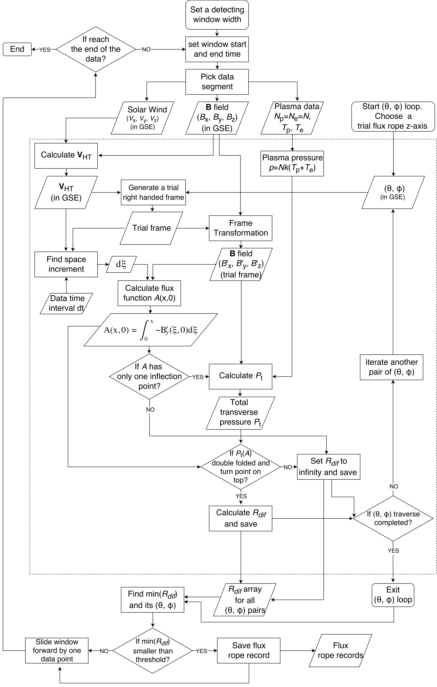
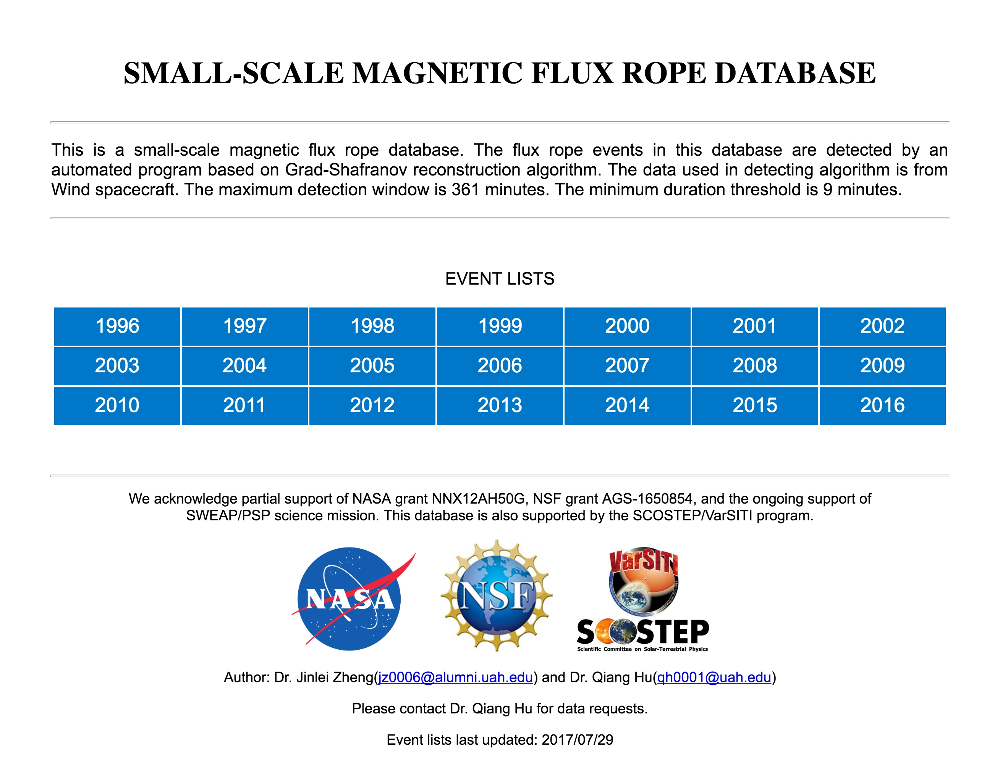
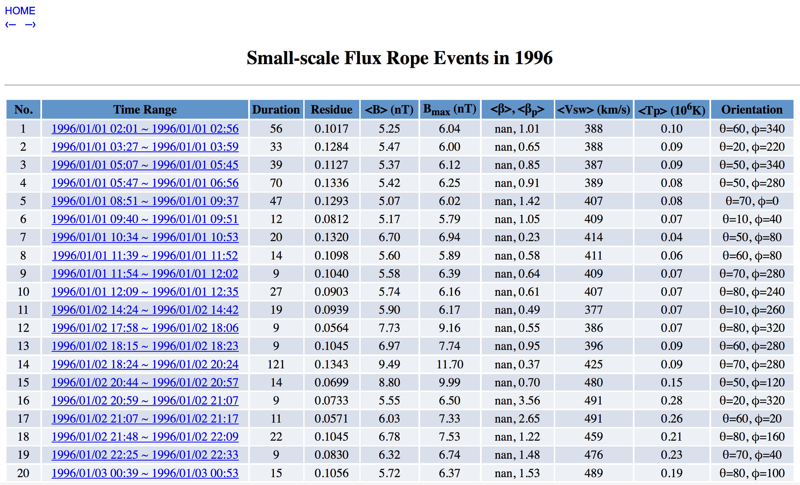
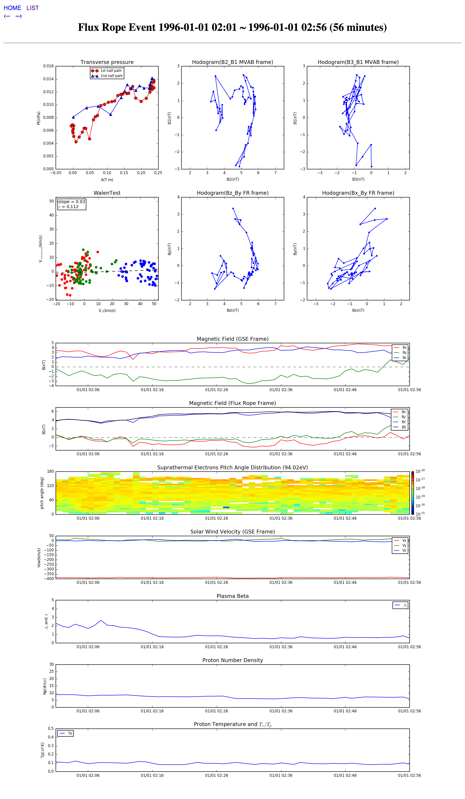

# Magnetic Flux Rope Detection

## 1. DESCRIPTION
This is an automated magnetic flux rope detection package. This project is part of my PhD research. The main purpose of this project is to automatically detect the small-scale magnetic flux ropes from in-situ spacecraft obervational data.

## 2. SPACE PHYSICS BACKGROUND
To get farmiliar with the physics of magnetic flux ropes, please refer to my PhD dissertation: [OBSERVATIONAL ANALYSIS OF TRANSIENT AND COHERENT STRUCTURES IN SPACE PLASMAS](phd_dissertation/). It will be discoverable soon on ProQuest dissertation database. I have one journal paper and two conference proceedings which talk about the statistical analysis and case studies on small-scale magnetic flux ropes. These papers are in the same folder of my dissertation.

## 3. CORE ALGORITHM FLOWCHART
Following is the flowchart of core detection algorithm. Please refer to chapter 2 and chapter 3 of my dissertation for detail.

## 4. CODE SETS
This project contains two sets of code. One set is used for detecting huge number of small-scale flux ropes across tens of years. The core detection code is high CPU intensive, which is intended to run on cluster server. Other tasks, such as downloading data, preprocessing data, postprocessing detected results, generating website, need less computing resource, which are intended to run on desktop computer or laptop computer. The other code set is used for short time range, quick detection. This quick detection code set is an all in one package, that is, user only need to provide the time range and data source, the package will do everthing else, including downloading and process data, detecting flux rope, cleaning results, and generating detected flux rope list. All function are modularized into a importable package. The quick detection package is intended to run on personal computer, so do not use it to carry out large scale detection.    
### 1) Code Used for Large Scale Detection
This code set contains 4 folders: a) [data_processing](data_processing/), b) [flux_rope_detection](\flux_rope_detection), c) [process_detected_result](process_detected_result/), d) [generate_website](generate_website/).
- a) [data_processing](data_processing/):  
     Use this package to download and preprocess data. Please read [this instruction](data_processing/README.md).
- b) [flux_rope_detection](\flux_rope_detection):  
     Use this package to apply the detection algorithm to the preprocessed data. Please read [this instruction](flux_rope_detection/README.md). This code is intended to run on high performance server. The code is parallelized.
- c) [process_detected_result](process_detected_result/):  
     Use this package to combine and clean raw results. Please read [this instruction](process_detected_result/README.md).
- d) [generate_website](generate_website/):  
     Use this package to create a website contains all detected flux ropes. Please read [this instruction](generate_website/README.md).
### 2) Code Used for Short Time Range Quick Detection
This code set is an upgraded version of the previous code set. In this set, all functions are modularized and are contained in a importable package wich is named by [MyPythonPackage](all_in_one_detection_package/MyPythonPackage/). The main functions are under [all_in_one_detection_package](all_in_one_detection_package/) folder. Please read [this instruction](all_in_one_detection_package/README.md) before use this package.

## 5. FINAL PRODUCT
The final product of this project is a comprehensive small-scale magnetic flux rope database that is hosted by a website. Please read [this instruction](generate_website/README.md) to get more details of the website. Following is the screenshots of the main page, flux rope list page, and flux rope event page.  

### 1) Main Page

[This](generate_website/webpage_screen_shot/Main_Page_Screen_Shot.png) is the screen shot of the main page.

### 2) Record Lists
[This](generate_website/webpage_screen_shot/Record_List_Screen_Shot.png) is the screen shot of the record lists page.

### 3) Event Pages and Plots
[This](generate_website/webpage_screen_shot/Event_Page_Screen_Shot.png) is the screen shot of the record lists page.

