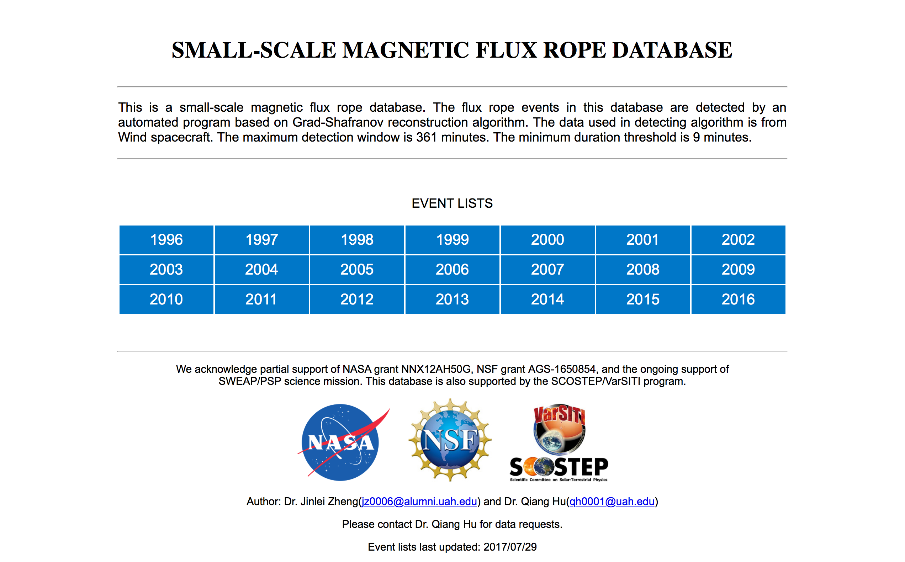

# Generate Website Using Python
## 1. DESCRIPTION
This package generates a completed static html website using python code. The webpage design is defined in python code. The python code will ouput html file. 

## 2. WEBSITE GENERATION STEPS
### 1) Main Page

The main page of the website is manually coded, which is under the folder website_main_page. [This](website_main_page/Main_Page_Screen_Shot.png) is the screen shot of the main page.

