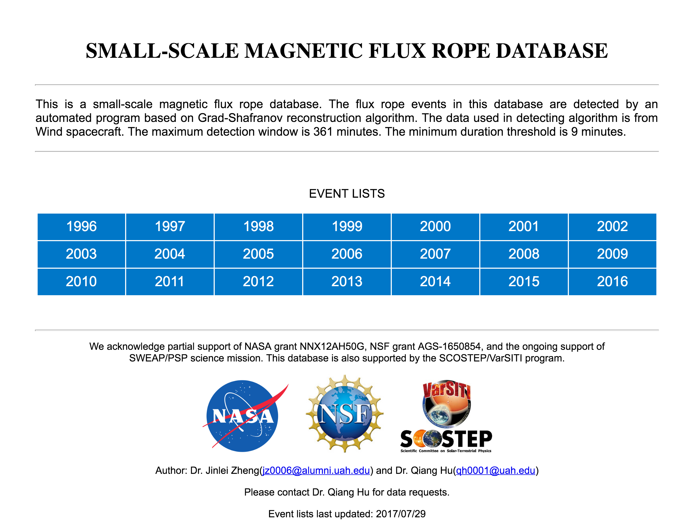

# Generate Website Using Python
## 1. DESCRIPTION
This package generates a completed static html website using python code. The webpage design is defined in python code. The python code will ouput html file. 

## 2. WEBSITE GENERATION STEPS
### 1) Main Page

The main page of the website is manually coded, which is under the folder website_main_page. [This](webpage_screen_shot/Main_Page_Screen_Shot.png) is the screen shot of the main page.

### 2) Record lists
Execute WEB_generate_html_form.py to generate Record lists. The command format is: python WEB_generate_html_form.py \[year\]. The Record lists page are organized by year. [This](webpage_screen_shot/Record_List_Screen_Shot.png) is the screen shot of the record lists page.

