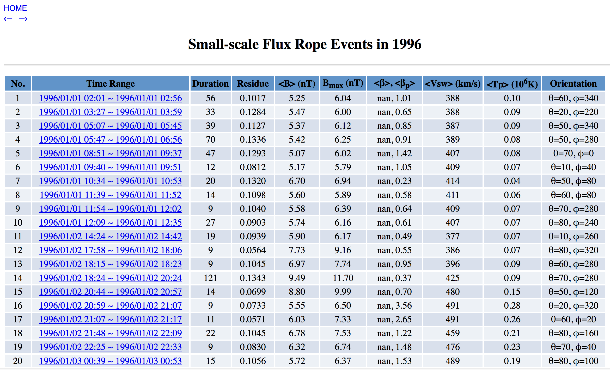

# Generate Website Using Python
## 1. DESCRIPTION
This package generates a completed static html website using python code. The webpage design is defined in python code. The python code will ouput html file. 

## 2. WEBSITE GENERATION STEPS
### 1) Main Page

The main page of the website is manually coded, which is under the folder website_main_page. [This](webpage_screen_shot/Main_Page_Screen_Shot.png) is the screen shot of the main page.

### 2) Record Lists
Execute WEB_generate_html_form.py to generate Record lists. The command format is: python WEB_generate_html_form.py \[year\]. The Record lists page are organized by year. [This](webpage_screen_shot/Record_List_Screen_Shot.png) is the screen shot of the record lists page.

### 3) Event Pages and Plots
Execute WEB_plotFluxRopeCandidate.py to generate plots used in webpage for each event. The command format is: python WEB_plotFluxRopeCandidate.py \[year\]. Then, execute WEB_generate_html_event_page.py to generate webpage for each event. The command format is: python WEB_generate_html_event_page.py \[year\]. [This](webpage_screen_shot/Event_Page_Screen_Shot.png) is the screen shot of the record lists page.

### 4) Website Map
Organize the generated html files and plots in the following way on server:
- public_html \(Folder name subject to change according to the web services on your server.\)
  - index.html \(This is the main page.\)
  - mainPageLogo \(Folder contains logo pictures.\)
    - NASA_logo_400x331.png
    - NSF_logo_200X200.jpg
    - scostep_varsiti_logo_700X550.jpg
  - 1996 \(Folder contains webpage files for each year.\)
    - year1996.html
    - events
      - 199601010201_199601010256.html
      - 199607281415_199607281625.html
      
      ...
      
      - 199607281220_199607281405.html
      
    - images
  - 1997
